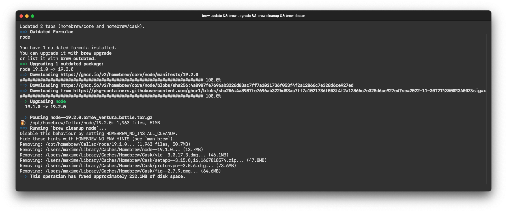

# hyper-cobalt

[![npm package][npm_version_badge]][npm_url]
[![Downloads][npm_counter_badge]][npm_url]
[![Build Status][travis_badge]][travis_url]
[![License][license_badge]][license_url]
[![website][website_badge]](http://seaweed.dk)

A Cobalt inspired theme for the [Hyper](https://hyper.is/) terminal.

Supports font ligatures.

## Usage

Add `'hyper-cobalt'` to your `plugins` fields that is in `config` object in your `~/.hyper.js` file, and your terminal should automatically reload with theme changes. To install using hpm-cli, run following command.

```shell
hpm install hyper-cobalt
```



[npm_version_badge]: http://img.shields.io/npm/v/hyper-cobalt.svg
[npm_counter_badge]: http://img.shields.io/npm/dt/hyper-cobalt.svg
[travis_badge]: https://img.shields.io/travis/TangChr/hyper-cobalt.svg?label=test
[license_badge]: https://img.shields.io/github/license/TangChr/hyper-cobalt.svg
[website_badge]: https://img.shields.io/badge/website-seaweed.dk-yellow.svg
[npm_url]: https://www.npmjs.com/package/hyper-cobalt
[travis_url]: https://travis-ci.org/TangChr/hyper-cobalt
[license_url]: https://raw.githubusercontent.com/TangChr/hyper-cobalt/master/LICENSE